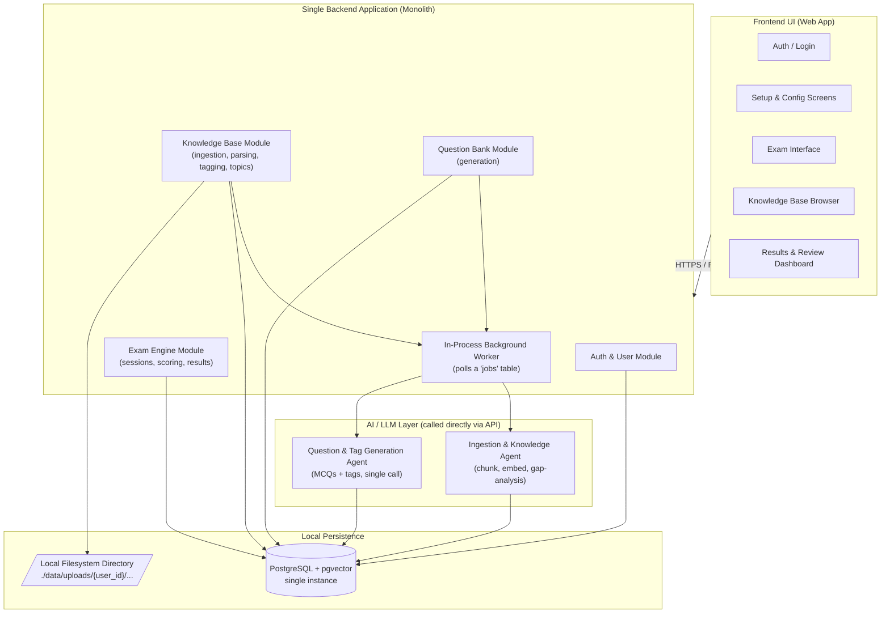

# System Architecture Document
## ExamI — Local-First MVP

---

## 1. Purpose

This document describes the architecture for a **lean, local-first version** of ExamI. The goal at this stage is a single small-footprint deployment (one server, or even one laptop) that proves out the core loop — ingest → generate → tag → exam → review — without the operational overhead of a distributed system.

The original enterprise-scale architecture is not discarded; it's deferred. Section 7 ("Migration Path") shows exactly where this design would split apart if/when scale demands it.

---

## 2. Architectural Principles (Revised for Lean MVP)

- **Monolith first.** All backend logic runs as a single deployable application with internal modules, not separate microservices. Fewer moving parts, fewer network hops, easier to run and debug locally.
- **One database, two jobs.** PostgreSQL with the `pgvector` extension serves as both the relational store *and* the vector store. No separate vector database to stand up or sync.
- **Filesystem over object storage.** Uploaded files live in a local directory on disk. No S3/MinIO dependency for a single-server deployment.
- **No external queue/cache infrastructure.** Background work (parsing, generation) runs as in-process async tasks, tracked via a simple `jobs` table in Postgres instead of Redis/Celery/SQS. Exam session state is read/written directly to Postgres rather than a separate cache.
- **User isolation is still non-negotiable.** Even at small scale, every query is scoped by `user_id`. This is a logic-layer guarantee, not an infrastructure-layer one, so it costs nothing extra to keep even in a simplified deployment.
- **Append-only knowledge growth.** Unchanged from the original design — new ingested content is merged into the existing knowledge base, never overwritten.

---

## 3. High-Level Architecture Diagram

---

## 4. Layer-by-Layer Breakdown

### 4.1 Frontend UI
Unchanged in responsibility from the original design — auth screens, the Setup Module, the Exam Interface, the Knowledge Base Browser, and the Results Dashboard. It talks to a single backend application over plain REST; there's no gateway/BFF tier to route through at this scale, since there's only one service to call.

### 4.2 Backend Application (Single Deployable, Modular Internally)

Instead of nine separate services, the backend is **one application** organized into four internal modules. They share the same process, the same database connection pool, and can call each other as plain function/class calls rather than network requests.

| Module | Responsibility (consolidates from the original design) |
|---|---|
| **Auth & User Module** | Login, signup, session/token handling, per-request `user_id` context. |
| **Knowledge Base Module** | File upload handling, parsing/chunking trigger, topic and tag management, deep-dive merge decisions. *(Consolidates the former Ingestion Service + Knowledge Base Service + Tagging & Metadata Service.)* |
| **Question Bank Module** | Requests question generation from the AI layer and persists the result, including tags returned in the same call. *(Consolidates the former Question Generation Service + part of the Tagging Service.)* |
| **Exam Engine Module** | Exam session lifecycle, server-side timer enforcement, scoring, and results/tag-performance aggregation. *(Consolidates the former Exam Engine Service + Results & Analytics Service.)* |

Each module is still implemented as a distinct internal package with a clear boundary — this keeps the door open to splitting any one of them into its own service later without a rewrite.

### 4.3 In-Process Background Worker
Parsing and AI generation can take a few seconds, so they still run asynchronously — but "asynchronously" here just means a background task within the same application process, not a separate distributed queue:
- A `jobs` table in Postgres tracks status (`pending`, `running`, `done`, `failed`) for ingestion and generation requests.
- A lightweight worker loop (or the framework's built-in background-task mechanism) picks up pending jobs and runs them in-process.
- The frontend polls a simple status endpoint (e.g., every 2–3 seconds) to show ingestion/generation progress — no WebSocket/SSE infrastructure required for this scale.

### 4.4 AI / LLM Layer
Reduced from five agents to two, by combining steps that don't need to be separate LLM calls:

| Agent | Role |
|---|---|
| **Ingestion & Knowledge Agent** | Extracts and chunks document text, generates embeddings, and compares new content against the user's existing topic/tag graph to decide whether it's a deep dive into an existing topic or a new one. *(Combines the former Document Understanding agent and Gap Analysis agent — both naturally happen during the same ingestion pass.)* |
| **Question & Tag Generation Agent** | Given a context scope, generates MCQs **and** their tags in a single structured-output call, reusing the user's existing tag vocabulary where possible. *(Combines the former Question Generation agent and Auto-Tagging agent — a single well-prompted call can return both in one structured JSON response, removing a network round-trip and an extra validation step.)* |

The **Web Research Agent** (scanning the web for supplementary material) is kept out of the MVP scope entirely — it's the one piece genuinely optional to the core loop and can be added later without touching anything else.

### 4.5 Persistence Layer

| Store | Purpose |
|---|---|
| **PostgreSQL + pgvector** | A single database serves both relational data (users, topics, questions, tags, exam sessions, attempts) and vector embeddings (via a `vector` column on the chunks table, using `pgvector`'s similarity search). No second system to deploy, sync, or keep consistent with the primary DB. |
| **Local Filesystem Directory** | Raw uploaded files are written to a directory on disk (e.g., `./data/uploads/{user_id}/{document_id}.pdf`), with the relative path stored in the database. |

No separate cache layer: active exam session state (current question, time remaining) is read and written directly to Postgres on each request. At the traffic levels this MVP targets, the extra round-trip is immaterial, and it removes Redis as a dependency.

---

## 5. Cross-Cutting Concerns

### 5.1 User Isolation
Unchanged in principle, simpler in practice: with a single database and no cross-service calls, every query the application issues includes a `user_id` filter sourced from the authenticated session — never from client input. `pgvector` similarity searches use the same `WHERE user_id = ...` filter as any other query, since embeddings live in the same table family rather than a separately-namespaced vector index.

### 5.2 Knowledge Base Growth ("Deep Dive" Merging)
Unchanged from the original design: the Ingestion & Knowledge Agent compares new content against existing embeddings and tags for that user, and the Knowledge Base Module decides whether to attach it under an existing topic or create a new one. Old questions and tags are never deleted or overwritten.

### 5.3 Security
- Uploaded files are still validated for type and size before being written to disk.
- The local uploads directory should sit outside any web-served static path, with access only through the application layer (never directly served by the web server) to avoid path-traversal or unauthorized-access risks.
- LLM API credentials are kept in environment variables / a local secrets file, not hardcoded — even in a single-server setup.

### 5.4 Scalability (At This Stage)
This architecture is intentionally scoped to **one application instance + one Postgres instance**, suitable for local development, a single small VPS, or a personal/small-team deployment. It is not designed to be load-balanced across multiple instances as-is, because background jobs and session state currently assume a single process. That tradeoff is intentional — it buys simplicity now, with an explicit path off this constraint described below.

---

## 6. Suggested Technology Stack (Lean MVP)

| Layer | Choice |
|---|---|
| Frontend | React (or a simpler server-rendered template if even that is overkill for the first cut) |
| Backend | A single Python (FastAPI) application, organized into modules |
| AI/LLM Layer | Gemini API, called directly from the Knowledge Base and Question Bank modules |
| Background Jobs | In-process async tasks + a `jobs` status table in Postgres (framework-native background tasks; no Celery/Redis/SQS) |
| Database (relational + vector) | PostgreSQL with the `pgvector` extension — one instance |
| File Storage | Local filesystem directory |
| Cache | None — session/exam state lives in Postgres |

---

## 7. Migration Path to Enterprise Scale (Deferred, Not Discarded)

When/if usage outgrows a single instance, the original enterprise design becomes the natural next step, and this lean architecture is built so each piece can peel off independently:

| When this becomes a bottleneck... | ...split out into |
|---|---|
| Single backend process can't handle concurrent load | Split the four modules into independently deployable services behind an API Gateway |
| In-process background worker can't keep up, or jobs need to survive a restart | Introduce Redis + a real queue (Celery/SQS/BullMQ) and dedicated worker processes |
| `pgvector` similarity search becomes a bottleneck at large embedding volumes | Move to a dedicated vector store (Pinecone/Weaviate) or a read-replica strategy for Postgres |
| Local disk storage becomes a constraint (multi-instance, durability, backup) | Swap the local uploads directory for S3-compatible object storage — the application's storage interface should be written behind a small abstraction so this is a config change, not a rewrite |
| Need to scale exam-taking independently of ingestion/generation load | Add a dedicated cache (Redis) for active session state, and scale the Exam Engine module's process independently |

Designing the four modules with clear internal boundaries now (rather than as one tangled codebase) is what makes this migration incremental later instead of a rewrite.
