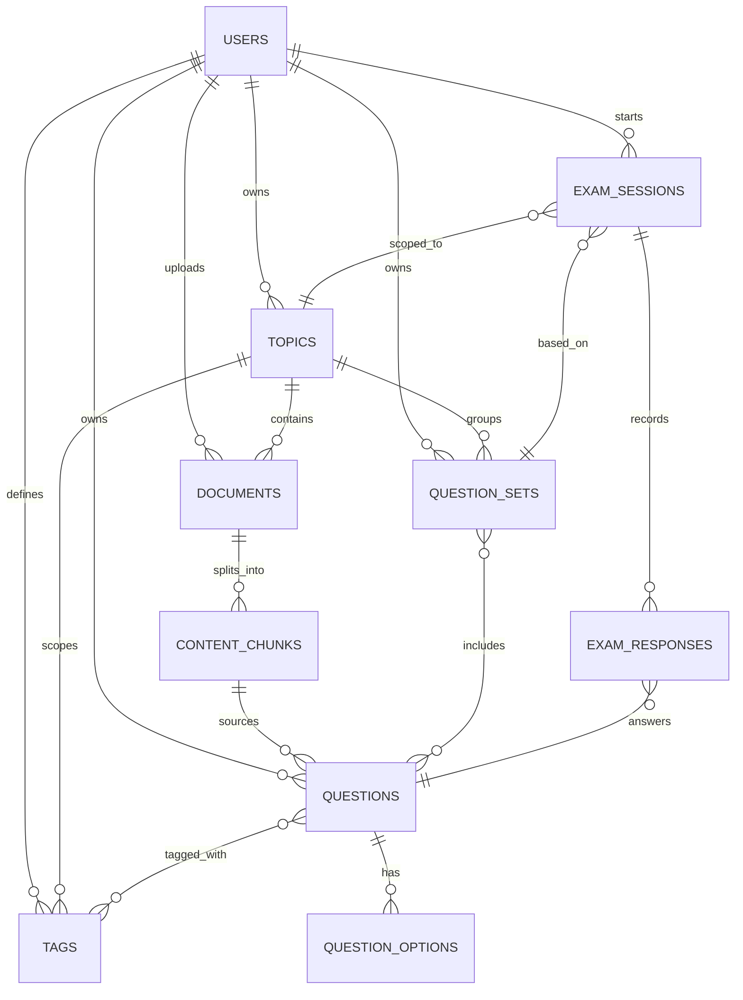

# Data Entity / Schema Design
## AI-Powered Exam Preparation Portal

---

## 1. Purpose

This document defines the logical data model required to support: strict user isolation, a fluid and continuously growing knowledge base, granular question tagging, and permanent reusability of generated questions. The model is presented in relational form (tables + foreign keys); it maps equivalently onto a document store if collections are substituted for tables and references for foreign keys.

> **Local-first note:** This schema runs entirely on a **single PostgreSQL instance with the `pgvector` extension enabled**. There is no separate vector database — embeddings are stored as a `vector` column directly on `content_chunks`, and similarity search is just another SQL query scoped by `user_id`, like everything else here. Raw uploaded files are referenced by a local filesystem path rather than an object-storage key.

---

## 2. Entity-Relationship Overview

---

## 3. Core Entities

### 3.1 `users`
Root of isolation — every other entity is reachable from a `user_id`.

| Field | Type | Notes |
|---|---|---|
| `id` | UUID (PK) | |
| `email` | string, unique | |
| `password_hash` | string | |
| `display_name` | string | |
| `created_at` | timestamp | |
| `plan_tier` | enum | free / pro / etc., for usage limits on AI generation |

---

### 3.2 `topics`
A top-level subject area the user is studying (e.g., "DSA & System Design", "Salesforce Certification"). This is the unit of isolation *within* a user's account — supports Journey E (multi-domain isolation for a single user) and Journey D (deep-dive growth within one topic).

| Field | Type | Notes |
|---|---|---|
| `id` | UUID (PK) | |
| `user_id` | UUID (FK → users.id) | **Required on every query** |
| `name` | string | e.g., "Data Structures & Algorithms" |
| `description` | text, nullable | |
| `created_at` | timestamp | |
| `updated_at` | timestamp | bumped on any deep-dive merge |

---

### 3.3 `documents`
Raw uploaded/sourced material, before or after parsing.

| Field | Type | Notes |
|---|---|---|
| `id` | UUID (PK) | |
| `user_id` | UUID (FK → users.id) | |
| `topic_id` | UUID (FK → topics.id) | which topic this was ingested into |
| `source_type` | enum | `upload_pdf`, `upload_text`, `manual_topic_text`, `web_scan` |
| `storage_path` | string, nullable | local filesystem path, e.g. `./data/uploads/{user_id}/{document_id}.pdf` |
| `original_filename` | string, nullable | |
| `status` | enum | `pending`, `parsing`, `parsed`, `failed` |
| `ingested_at` | timestamp | |

---

### 3.4 `content_chunks`
Output of the parsing/chunking pipeline — the semantic units the AI layer uses as generation context. With `pgvector`, this table also *is* the vector store — no separate system to query.

| Field | Type | Notes |
|---|---|---|
| `id` | UUID (PK) | |
| `document_id` | UUID (FK → documents.id) | |
| `user_id` | UUID (FK → users.id) | denormalized for isolation-safe queries |
| `topic_id` | UUID (FK → topics.id) | denormalized |
| `chunk_text` | text | |
| `embedding` | `vector(N)` (pgvector type) | `N` = the embedding model's dimension (e.g. 1536); indexed for similarity search |
| `chunk_index` | integer | ordering within the source document |

---

### 3.5 `tags`
The granular tagging taxonomy. Tags are scoped per user (and conceptually nested under a topic) to keep User A's "Trees" from colliding with User B's "Trees", and to let the Auto-Tagging Agent reuse a consistent vocabulary per user rather than inventing duplicates each time.

| Field | Type | Notes |
|---|---|---|
| `id` | UUID (PK) | |
| `user_id` | UUID (FK → users.id) | |
| `topic_id` | UUID (FK → topics.id) | |
| `name` | string | e.g., `Linked Lists`, `Greedy Algorithms` |
| `parent_tag_id` | UUID, nullable (FK → tags.id) | supports topic → sub-topic → concept hierarchy |
| `created_by` | enum | `ai_generated`, `user_defined` |
| `created_at` | timestamp | |

> Unique constraint on (`user_id`, `topic_id`, `name`) to prevent duplicate tags within the same scope; the Gap Analysis / Auto-Tagging Agent should check this table before creating a new tag.

---

### 3.6 `questions`
The permanent, reusable question bank. Every question generated is stored here indefinitely.

| Field | Type | Notes |
|---|---|---|
| `id` | UUID (PK) | |
| `user_id` | UUID (FK → users.id) | |
| `topic_id` | UUID (FK → topics.id) | |
| `source_chunk_id` | UUID, nullable (FK → content_chunks.id) | traceability to source material |
| `question_text` | text | |
| `explanation` | text, nullable | shown in practice mode / review |
| `difficulty` | enum | `easy`, `medium`, `hard` |
| `generated_by` | enum | `ai`, `manual` |
| `created_at` | timestamp | |
| `is_active` | boolean | soft-delete flag; questions are never hard-deleted to preserve attempt history integrity |

---

### 3.7 `question_options`
Normalized MCQ options (alternative to storing as a JSON array on `questions`, chosen here for query/analytics flexibility).

| Field | Type | Notes |
|---|---|---|
| `id` | UUID (PK) | |
| `question_id` | UUID (FK → questions.id) | |
| `option_text` | text | |
| `is_correct` | boolean | |
| `option_order` | integer | display order |

---

### 3.8 `question_tags` (join table)
Many-to-many between questions and tags — the heart of the "granular tagging system."

| Field | Type | Notes |
|---|---|---|
| `question_id` | UUID (FK → questions.id) | |
| `tag_id` | UUID (FK → tags.id) | |

> Composite PK on (`question_id`, `tag_id`).

---

### 3.9 `question_sets`
A named, savable grouping of questions — supports "select an existing, previously prepared exam question set" (Journey B), distinct from the raw per-topic question bank (Journey C generates new sets without disturbing old ones).

| Field | Type | Notes |
|---|---|---|
| `id` | UUID (PK) | |
| `user_id` | UUID (FK → users.id) | |
| `topic_id` | UUID (FK → topics.id) | |
| `name` | string | e.g., "DSA — Arrays & Linked Lists, 40 Qs" |
| `generation_scope` | JSON, nullable | tags/filters used when this set was generated, for traceability |
| `created_at` | timestamp | |

### 3.10 `question_set_items` (join table)
| Field | Type | Notes |
|---|---|---|
| `question_set_id` | UUID (FK → question_sets.id) | |
| `question_id` | UUID (FK → questions.id) | |
| `position` | integer | optional fixed ordering |

---

### 3.11 `exam_sessions`
A single instance of a user taking an exam (practice or timed).

| Field | Type | Notes |
|---|---|---|
| `id` | UUID (PK) | |
| `user_id` | UUID (FK → users.id) | |
| `topic_id` | UUID (FK → topics.id) | |
| `question_set_id` | UUID, nullable (FK → question_sets.id) | null if dynamically scoped by tags rather than a saved set |
| `mode` | enum | `practice`, `timed` |
| `tag_filter` | JSON, nullable | tags used to scope this session, if not using a fixed set |
| `difficulty_filter` | enum, nullable | |
| `question_count` | integer | |
| `time_limit_seconds` | integer, nullable | null for practice mode |
| `status` | enum | `in_progress`, `completed`, `abandoned` |
| `started_at` | timestamp | |
| `completed_at` | timestamp, nullable | |
| `score` | numeric, nullable | computed on completion |

---

### 3.12 `exam_responses`
One row per question answered within a session — the basis for scoring and tag-level performance analytics.

| Field | Type | Notes |
|---|---|---|
| `id` | UUID (PK) | |
| `exam_session_id` | UUID (FK → exam_sessions.id) | |
| `question_id` | UUID (FK → questions.id) | |
| `selected_option_id` | UUID, nullable (FK → question_options.id) | null if skipped/timed out |
| `is_correct` | boolean | |
| `time_taken_seconds` | integer, nullable | |
| `answered_at` | timestamp | |

---

## 4. Isolation Enforcement Notes

- Every table that is not purely a join table carries a `user_id` (directly or denormalized via its parent), enabling a single, consistently-applied row-level security policy (e.g., Postgres RLS: `user_id = current_user_id()`).
- No table or query path joins across two different `user_id` values.
- Because embeddings live in `content_chunks` alongside everything else (via `pgvector`), similarity search is just `SELECT ... WHERE user_id = $1 ORDER BY embedding <-> $2 LIMIT k` — isolation is enforced by the exact same `WHERE` clause as any other query, with no separate namespacing layer to keep in sync.

---

## 5. Supporting the "Fluid Growth" Requirement

- New `documents` and `content_chunks` are always inserted, never overwrite existing rows for the same `topic_id`.
- New `tags` are inserted under the existing `topic_id`, optionally as children of existing tags via `parent_tag_id` — this is what allows "Greedy Algorithms" to attach under an existing "Data Structures" topic without disturbing prior tags like "Linked Lists".
- `questions` are append-only (logically deleted via `is_active`, never hard-deleted), so a `question_set` or `exam_session` referencing them remains valid indefinitely, satisfying the "permanently stored, reusable question bank" requirement.

---

## 6. Indexing Recommendations

| Table | Suggested Index |
|---|---|
| `topics` | (`user_id`) |
| `documents` | (`user_id`, `topic_id`) |
| `tags` | (`user_id`, `topic_id`, `name`) unique |
| `questions` | (`user_id`, `topic_id`), (`is_active`) |
| `question_tags` | (`tag_id`), (`question_id`) |
| `exam_sessions` | (`user_id`, `topic_id`, `status`) |
| `exam_responses` | (`exam_session_id`), (`question_id`) |
| `content_chunks` | (`user_id`); plus a `pgvector` index on `embedding` (HNSW for best quality, or IVFFlat for lower memory) — at MVP data volumes, a plain sequential scan filtered by `user_id` may even be fast enough before an index is needed at all |

## 7. Why a Single Postgres Instance Is Enough For Now

A dedicated vector database earns its keep when embedding volume is large enough that approximate-nearest-neighbor indexing meaningfully outperforms `pgvector`'s indexing, or when vector search needs to scale independently of the relational workload. For a single-user-at-a-time or small-team local deployment, the embedding volume per user (one syllabus, a handful of documents) is small enough that `pgvector` inside the same Postgres instance is not just adequate but simpler to operate, back up, and reason about — there's exactly one database to manage, one connection pool, one backup job, and one place isolation rules are enforced.
